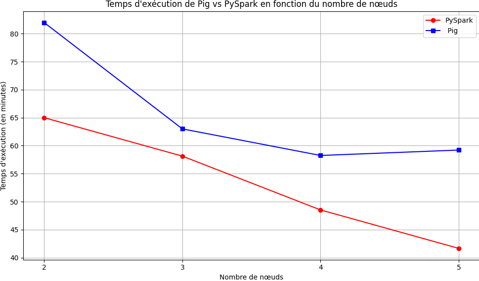

# 🚀 Expérience PageRank Performance on GCP with Pig and PySpark

## 🎓 Faculté des Sciences et des Techniques - Nantes Université

---

**Description**: Ce dépôt fournit des directives étape par étape et des scripts pour configurer et exécuter un cluster Hadoop/Spark sur Google Cloud Platform (GCP). L'objectif principal est d'utiliser Pig et PySpark pour l'implémentation de PageRank.

### 📚 Gestion des données distribuées à large échelle

- **Professeur**: M. MOLLI Pascal  
- **Étudiants**:
  - ASRIR Imrane
  - JBARI Khaoula
  - AJOUTATE Safae

---

## 📘 PageRank - Comparaison entre Pig et PySpark  

**Consigne**: [Consultez les détails de la consigne ici](https://madoc.univ-nantes.fr/mod/assign/view.php?id=1523335)

## 📚 Table of Contents
- [**Setting Up on GCP**](./setup/gcp_setup.md)
- [**Hadoop and Spark Installation & Configuration**](./setup/hadoop_spark_setup.md)

## 🚀 Running PageRank

### 🐖 Pig

📁 **Directory**: `scripts/pig/`   
🔧 **Command**: Use `run_pagerank.sh` to initiate the PageRank computation.

| Nombre de nœuds | Temps d'exécution | Dataproc Job ID |
|:---------------:|:-----------------:|:---------------:|
| 2               | 1h 22min          | `8adfa467418740639f80428886007559` |
| 3               | 1h 10min          | `104ad0ee059d84dd7a108cb95c23387e1` |
| 4               | 58min 15s         | `4ecdd4e131e154d38b3e193019ed9cb09` |
| 5               | 51min 13s         | `d273d8af8251a474fa55d3a6cbbb3d87be` |

### 🔥 PySpark

📁 **Directory**: `scripts/pyspark/`   
🔧 **Command**: Use `run.sh` to initiate the PageRank computation.

| Nombre de nœuds | Temps d'exécution | Dataproc Job ID |
|:---------------:|:-----------------:|:---------------:|
| 2               | 1h 5min           | `d197e9a75eb84e728f168ce07d1b2849` |
| 3               | 54min 8s          | `efb42eb6d08847768a6543a5ee8c7176` |
| 4               | 48min 31s         | `dcc9ddf87ec74685b960af7eef3763ea` |
| 5               | 49min 39s         | `2b2acb5c8bd7c41b4bb50232d9ecc0bd` |

## 📊 Comparaison entre Pig et PySpark

*Le graphique ci-dessus montre la comparaison des temps d'exécution entre Pig et PySpark sur différents nombres de nœuds. Il est clair que la performance varie en fonction du nombre de nœuds et de la technologie utilisée.*

### Tendance générale
- 📈 L'augmentation du nombre de nœuds réduit généralement le temps d'exécution pour les deux frameworks.

### Performance de Pig vs PySpark
- **Avec 2 nœuds** : Pig est plus lent que PySpark de 17 minutes.
- **Avec 3 nœuds** : Pig est plus rapide que PySpark de 5 minutes.
- **Avec 4 nœuds** : Pig est plus lent que PySpark de presque 10 minutes.
- **Avec 5 nœuds** : Pig est plus lent que PySpark de 17 minutes et 34 secondes.

### Efficacité de l'ajout de nœuds
- **Pour Pig** : La réduction du temps d'exécution se stabilise après 3 nœuds.
- **Pour PySpark** : Le temps d'exécution continue de diminuer même avec l'ajout du cinquième nœud.

### 📍 Points clés:
1. L'ajout de nœuds améliore la parallélisation et réduit le temps d'exécution pour les deux frameworks.
2. PySpark dépasse Pig en performance dans la plupart des configurations de nœuds, sauf avec 3 nœuds où Pig est légèrement plus rapide.
3. L'efficacité de PySpark semble augmenter de manière plus constante avec l'ajout de nœuds par rapport à Pig.

## 🎯 Conclusion

Même si Pig présente une meilleure performance dans la configuration à 3 nœuds, PySpark se montre généralement plus rapide dans les autres configurations. Il est recommandé d'utiliser PySpark pour des clusters avec un grand nombre de nœuds pour maximiser la performance. Cependant, les performances spécifiques peuvent varier selon la tâche, la configuration du cluster et d'autres paramètres, d'où la nécessité de réaliser des tests adaptés à l'environnement et aux besoins réels.
