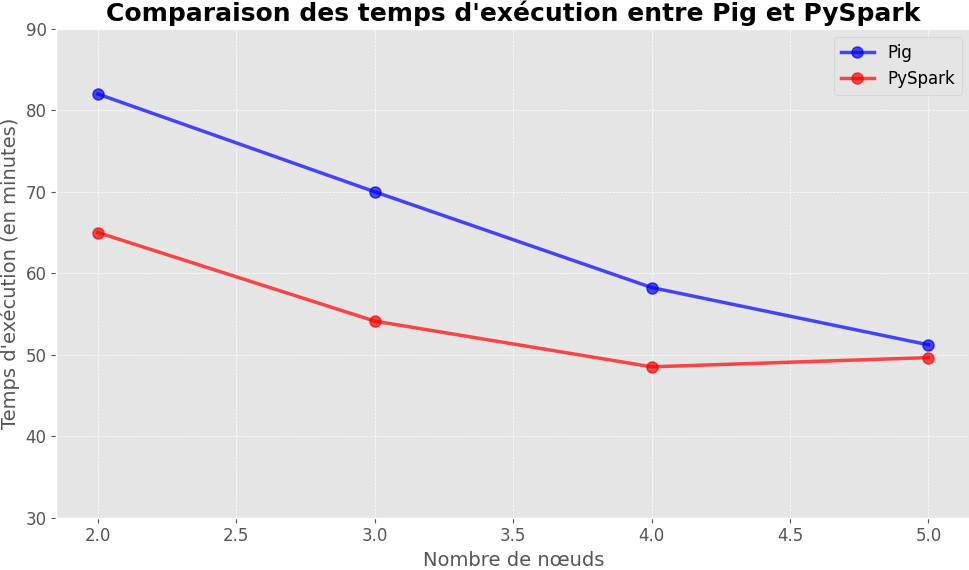

# Hadoop/Spark Cluster on GCP with Pig and PySpark

This repository provides step-by-step guidelines and scripts to set up and run a Hadoop/Spark cluster on Google Cloud Platform (GCP) using Pig and PySpark for PageRank implementation.

## Table of Contents:
- [Setting Up on GCP](./setup/gcp_setup.md)
- [Hadoop and Spark Installation & Configuration](./setup/hadoop_spark_setup.md)
- [Running PageRank with Pig and PySpark](#running-pagerank)
- [Monitoring Performance](./monitoring/performance_monitoring.md)

## Running PageRank

### Pig

Navigate to `scripts/pig/` and use `run_pagerank.sh` to initiate the PageRank computation.

| Nombre de nœuds |Temps d'exécution| Dataproc Job ID             |
|-----------------|-----------------|-----------------------------|
| 2               | 1h 5min         | `d197e9a75eb84e728f168ce07d1b2849` |
| 3               | 58min 8s        | `efb42eb6d08847768a6543a5ee8c7176` |
| 4               | 48min 31s       | `dcc9ddf87ec74685b960af7eef3763ea` |
| 5               | 41min 39s       | `2b2acb5c8bd7c41b4bb50232d9ecc0bd` |

### PySpark

| Nombre de nœuds | Temps d'exécution | Dataproc Job id                         |
|-----------------|-------------------|-----------------------------------------|
| 2               | 1 h 22 min        | `8adfa467418740639f80428886007559`       |
| 3               | 1 h 3 min         | `104ad0ee059d84dd7a108cb95c23387e1`      |
| 4               | 58 min 15 s       | `4ecdd4e131e154d38b3e193019ed9cb09`      |
| 5               | 59 min 13 s       | `d273d8af8251a474fa55d3a6cbbb3d87be`     |

# Comparaison entre Pig et PySpark

Ce projet vise à évaluer la performance de deux frameworks populaires de traitement de données, Pig et PySpark, en fonction du nombre de nœuds utilisés.

## Analyse

Le graphe illustre le temps d'exécution des deux frameworks en fonction du nombre de nœuds.

### Points clés:

1. Pour les deux frameworks, l'augmentation du nombre de nœuds tend à réduire le temps d'exécution, indiquant une meilleure parallélisation avec plus de nœuds.
2. Au début, Pig a une performance supérieure à celle de PySpark, surtout avec un nombre de nœuds réduit.
3. À mesure que davantage de nœuds sont ajoutés, PySpark commence à rattraper Pig en termes de performance. En particulier, avec 5 nœuds, les temps d'exécution de Pig et PySpark sont presque équivalents.

### Conclusion:

Bien que Pig ait montré une meilleure performance au début, la différence de performance entre les deux frameworks diminue avec l'ajout de plus de nœuds. Il est crucial de tester ces frameworks avec diverses tâches et paramètres pour obtenir une évaluation complète.

